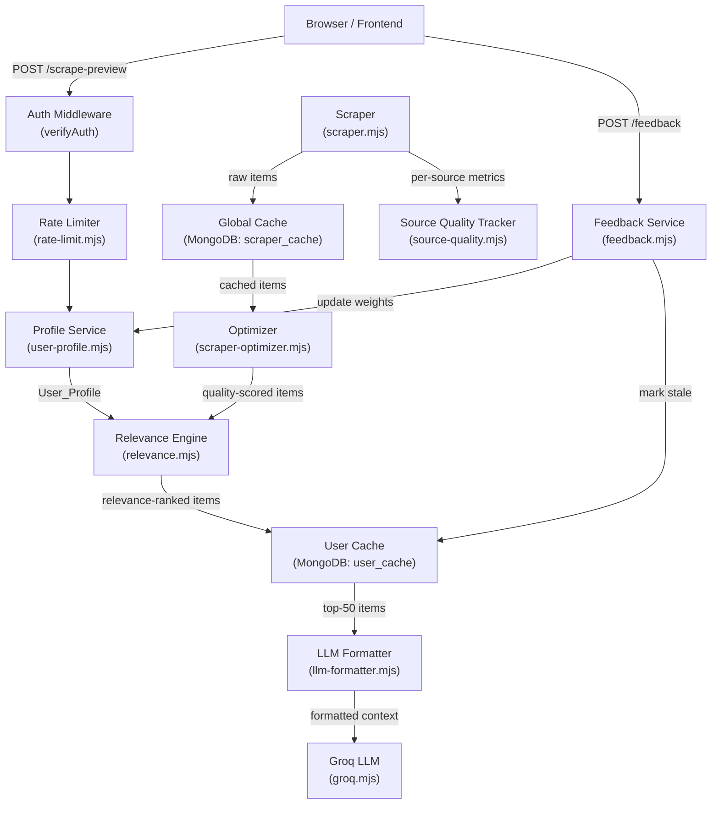

# Design Document: Scraping Optimization

## Overview

This feature transforms VentureLens from a single-user, stateless scraping pipeline into a personalized, SaaS-ready content delivery system. The core insight is that the existing scraper already produces high-quality raw data — the gap is in *relevance*: every user sees the same generic results regardless of their interests.

The design introduces five interconnected subsystems:

1. **User Interest Profiles** — per-user domain preferences stored in MongoDB
2. **Per-User Relevance Scoring** — extends the existing `scraper-optimizer.mjs` quality scoring with user-specific weights
3. **Feedback Loop** — thumbs up/down/save/skip signals that update preference weights over time
4. **Per-User Cache Layer** — derived from the existing Global_Cache, avoiding redundant scraping
5. **Rate Limiting** — sliding-window per-user request throttling

All components operate within Netlify Functions' 10-second timeout constraint and use MongoDB Atlas as the sole persistence layer (no new infrastructure).

### Key Design Decisions

- **No new scraping infrastructure**: The existing `scraper.mjs` and `scraper-optimizer.mjs` are extended, not replaced. The Global_Cache remains the single source of truth for raw scraped data.
- **In-process relevance scoring**: Relevance scoring runs in-memory within the Netlify function, not as a separate service, to stay within the timeout budget.
- **MongoDB-only persistence**: All new state (profiles, user caches, feedback, rate limits, source quality) goes into the existing `venturelens` MongoDB database as new collections.
- **Backward compatibility**: All new behavior is additive. Unauthenticated or profile-less users fall back to the existing pipeline unchanged.

---

## Architecture



### Request Flow (Happy Path)

1. Client sends `POST /scrape-preview` with Bearer token
2. Auth middleware validates JWT → extracts `userId`
3. Rate limiter checks `rate_limits` collection → allows or returns 429
4. Profile service loads `User_Profile` from `user_profiles` collection (or returns defaults)
5. Relevance engine checks `user_cache` collection for a valid cache hit
6. On cache miss: loads Global_Cache → runs Optimizer → runs per-user relevance scoring → writes User_Cache
7. LLM Formatter builds personalized context string
8. Groq LLM generates ideas
9. Response returned to client

---

## Components and Interfaces

### New Files

| File | Purpose |
|------|---------|
| `netlify/functions/lib/user-profile.mjs` | CRUD for User_Profile documents |
| `netlify/functions/lib/relevance.mjs` | Per-user relevance scoring engine |
| `netlify/functions/lib/feedback.mjs` | Feedback signal persistence and weight updates |
| `netlify/functions/lib/rate-limit.mjs` | Sliding-window rate limit checks |
| `netlify/functions/lib/source-quality.mjs` | Source quality record upserts and reads |
| `netlify/functions/lib/llm-formatter.mjs` | Personalized LLM context formatter |
| `netlify/functions/update-profile.mjs` | Netlify Function: save/update User_Profile |
| `netlify/functions/submit-feedback.mjs` | Netlify Function: record Feedback_Signal |
| `netlify/functions/source-quality.mjs` | Netlify Function: read Source_Quality_Records |

### Modified Files

| File | Change |
|------|--------|
| `netlify/functions/scrape-preview.mjs` | Add rate limiting, profile loading, user cache check |
| `netlify/functions/lib/scraper.mjs` | Reduce `FETCH_TIMEOUT_MS` to 4000, add per-source timing/status logging |
| `netlify/functions/lib/scraper-optimizer.mjs` | Add source credibility multiplier from quality records |

### Interface Definitions

```javascript
// user-profile.mjs
export async function getProfile(userId)           // → User_Profile | null
export async function saveProfile(userId, profile) // → void
export async function getDefaultWeights()          // → Record<string, 1.0>

// relevance.mjs
export function computeRelevanceScore(item, userProfile)  // → number (0-100)
export function rankItemsForUser(items, userProfile)       // → Item[] sorted desc
export async function getUserCache(userId, globalVersion)  // → Item[] | null
export async function setUserCache(userId, globalVersion, items) // → void
export async function invalidateUserCache(userId)          // → void

// feedback.mjs
export async function recordFeedback(signal)       // → void
export async function applyFeedbackToProfile(userId, signal) // → User_Profile

// rate-limit.mjs
export async function checkRateLimit(userId, ip)   // → { allowed: boolean, retryAfterSeconds?: number }

// source-quality.mjs
export async function upsertSourceQuality(sourceName, metrics) // → void
export async function getSourceQuality(sourceName)             // → Source_Quality_Record | null
export async function getAllSourceQuality()                     // → Source_Quality_Record[]
export function getCredibilityMultiplier(record)               // → number (0.5 or 1.0)

// llm-formatter.mjs
export function formatForUser(rankedItems, userProfile)        // → string
export function formatFallback(scraped)                        // → string (delegates to existing formatScrapedDataForLLM)
```

---

## Data Models

### User_Profile (collection: `user_profiles`)

```javascript
{
  _id: string,                    // userId (from JWT)
  interestDomains: string[],      // subset of INTEREST_DOMAINS
  skillLevel: "technical" | "non-technical" | "mixed",
  ideaSize: "micro-saas" | "full-startup" | "any",
  preferenceWeights: {            // domain → weight (0.1–3.0)
    "AI/ML Tools": 1.0,
    "Developer Tools": 1.0,
    // ...
  },
  createdAt: string,              // ISO timestamp
  updatedAt: string,
}
```

### Feedback_Signal (collection: `feedback_signals`)

```javascript
{
  _id: ObjectId,
  userId: string,
  itemId: string,                 // hash of title+source
  itemSource: string,
  itemDomains: string[],          // matched Interest_Domains
  signalType: "thumbs_up" | "thumbs_down" | "save" | "skip",
  timestamp: string,
}
```

### User_Cache (collection: `user_cache`)

```javascript
{
  _id: string,                    // userId
  globalCacheVersion: string,     // ISO timestamp of Global_Cache scrapedAt
  rankedItems: Item[],            // top-50, sorted by relevance desc
  computedAt: string,
  isStale: boolean,
  expiresAt: Date,                // TTL index: 6 hours from computedAt
}
```

### Source_Quality_Record (collection: `source_quality`)

```javascript
{
  _id: string,                    // sourceName
  lastFetchAt: string,
  fetchDurationMs: number,
  itemCount: number,
  averageQualityScore: number,
  successRate: number,            // rolling 7-day (0.0–1.0)
  errorCount: number,
  lastError: string | null,
  consecutiveLowScoreSessions: number,
}
```

### Rate_Limit_Record (collection: `rate_limits`)

```javascript
{
  _id: string,                    // userId or "ip:<address>"
  requestTimestamps: number[],    // Unix ms timestamps, pruned to last 60 min
  updatedAt: string,
}
```

### Predefined Interest Domains

```javascript
export const INTEREST_DOMAINS = [
  "AI/ML Tools",
  "Developer Tools",
  "No-Code/Low-Code",
  "B2B SaaS",
  "Consumer Apps",
  "Productivity",
  "E-commerce",
  "Data & Analytics",
];
```

### Domain Keyword Map (minimum 5 keywords per domain)

```javascript
export const DOMAIN_KEYWORDS = {
  "AI/ML Tools":       ["ai", "machine learning", "llm", "gpt", "neural", "model", "inference", "embedding", "nlp", "chatbot"],
  "Developer Tools":   ["api", "sdk", "cli", "devops", "ci/cd", "github", "developer", "debugging", "testing", "deployment"],
  "No-Code/Low-Code":  ["no-code", "low-code", "nocode", "zapier", "airtable", "bubble", "webflow", "automation", "workflow", "drag-and-drop"],
  "B2B SaaS":          ["b2b", "saas", "enterprise", "crm", "erp", "subscription", "mrr", "arr", "business", "team"],
  "Consumer Apps":     ["consumer", "mobile", "app", "social", "personal", "lifestyle", "health", "fitness", "entertainment", "game"],
  "Productivity":      ["productivity", "task", "todo", "calendar", "focus", "time tracking", "project management", "notes", "organize", "efficiency"],
  "E-commerce":        ["ecommerce", "shopify", "store", "product", "checkout", "payment", "inventory", "marketplace", "retail", "shop"],
  "Data & Analytics":  ["analytics", "dashboard", "metrics", "data", "reporting", "visualization", "bi", "insights", "tracking", "monitoring"],
};
```

---

## Correctness Properties

*A property is a characteristic or behavior that should hold true across all valid executions of a system — essentially, a formal statement about what the system should do. Properties serve as the bridge between human-readable specifications and machine-verifiable correctness guarantees.*

### Property 1: User_Profile contains all required fields

*For any* User_Profile created via `saveProfile`, the stored document SHALL contain `interestDomains`, `skillLevel`, `ideaSize`, `preferenceWeights`, and `createdAt` fields with correct types.

**Validates: Requirements 1.1**

---

### Property 2: Missing profile defaults to equal weights

*For any* userId that has no User_Profile in the database, calling `getDefaultWeights()` SHALL return an object where every predefined Interest_Domain maps to exactly `1.0`.

**Validates: Requirements 1.3**

---

### Property 3: Profile update preserves feedback history

*For any* userId with existing Feedback_Signals in the database, updating the User_Profile's `interestDomains` SHALL leave all Feedback_Signal documents for that userId unchanged.

**Validates: Requirements 1.5**

---

### Property 4: Relevance score formula correctness

*For any* scraped item with a global quality score Q and any User_Profile where the item matches a set of domains D with weights W, the computed Relevance_Score SHALL equal `Q * sum(W for each domain in D)`. When D is empty, the score SHALL equal `Q * 0.3`.

**Validates: Requirements 2.1, 2.2**

---

### Property 5: Ranked items are sorted descending

*For any* list of items passed through `rankItemsForUser`, the returned array SHALL be sorted in descending order of `relevanceScore` — that is, for every adjacent pair `(items[i], items[i+1])`, `items[i].relevanceScore >= items[i+1].relevanceScore`.

**Validates: Requirements 2.3**

---

### Property 6: Positive feedback increases weight (capped at 3.0)

*For any* User_Profile with a domain weight `w` (where `0.1 <= w <= 3.0`) and a `thumbs_up` or `save` Feedback_Signal for an item in that domain, the new weight SHALL equal `min(w + 0.1, 3.0)`.

**Validates: Requirements 3.2**

---

### Property 7: Negative feedback decreases weight (floored at 0.1)

*For any* User_Profile with a domain weight `w` (where `0.1 <= w <= 3.0`) and a `thumbs_down` Feedback_Signal for an item in that domain, the new weight SHALL equal `max(w - 0.1, 0.1)`.

**Validates: Requirements 3.3**

---

### Property 8: Skip feedback is a no-op on weights

*For any* User_Profile with any set of domain weights, recording a `skip` Feedback_Signal SHALL leave all `preferenceWeights` values identical to their values before the signal was recorded.

**Validates: Requirements 3.4**

---

### Property 9: User_Cache contains at most 50 items, sorted by relevance

*For any* User_Cache document written by `setUserCache`, the `rankedItems` array SHALL have length `<= 50` and SHALL be sorted in descending order of `relevanceScore`.

**Validates: Requirements 4.1**

---

### Property 10: Weight change marks cache stale

*For any* userId whose `preferenceWeights` are updated (by any Feedback_Signal that is not `skip`), the corresponding User_Cache document SHALL have `isStale = true` after the update.

**Validates: Requirements 4.4**

---

### Property 11: LLM context filters by relevance threshold

*For any* set of scored items passed to `formatForUser`, the formatted output string SHALL NOT contain any item whose `relevanceScore` is `<= 40`, and SHALL contain at most 60 items total.

**Validates: Requirements 5.1**

---

### Property 12: LLM context includes score and tier for each item

*For any* item included in the formatted LLM context output, the output string SHALL contain both the item's numeric `relevanceScore` and its priority tier label (`GOLD`, `HIGH`, or `MEDIUM`).

**Validates: Requirements 5.5**

---

### Property 13: Item descriptions are truncated to 120 characters

*For any* item with a description of any length, the description as it appears in the formatted LLM context SHALL have length `<= 120` characters.

**Validates: Requirements 5.4**

---

### Property 14: Source quality record contains all required fields

*For any* completed Scrape_Session, the `upsertSourceQuality` call for each source SHALL produce a document containing `sourceName`, `lastFetchAt`, `fetchDurationMs`, `itemCount`, `averageQualityScore`, `successRate`, and `errorCount`.

**Validates: Requirements 6.1**

---

### Property 15: Source failure increments errorCount and does not halt session

*For any* Scrape_Session where one or more sources fail, the `errorCount` for each failed source SHALL be incremented by 1, and the session SHALL still return results from the remaining sources.

**Validates: Requirements 6.2, 9.2**

---

### Property 16: Low-success-rate sources receive 0.5 credibility multiplier

*For any* Source_Quality_Record where `successRate < 0.5`, calling `getCredibilityMultiplier(record)` SHALL return `0.5`. For records where `successRate >= 0.5`, it SHALL return `1.0`.

**Validates: Requirements 6.3**

---

### Property 17: Rate limit enforced at 10 requests per hour

*For any* authenticated userId, after exactly 10 requests within a 60-minute sliding window, the 11th request within that window SHALL be rejected with `allowed: false` and a positive `retryAfterSeconds` value.

**Validates: Requirements 7.1**

---

### Property 18: Sliding window prunes old timestamps

*For any* `Rate_Limit_Record` with an array of request timestamps, after calling the pruning function, all remaining timestamps SHALL be within the last 60 minutes (i.e., `timestamp >= Date.now() - 3_600_000`).

**Validates: Requirements 7.3**

---

### Property 19: Domain filter excludes low-relevance items

*For any* request with a `domains[]` parameter and any set of scored items, the Optimizer SHALL exclude all items whose Relevance_Score for the specified domains is `< 30`. If fewer than 5 items remain, the threshold SHALL be relaxed to `10` and the filter retried.

**Validates: Requirements 8.2, 8.3**

---

### Property 20: Invalid domain values produce HTTP 400

*For any* request where `domains[]` contains at least one value not in `INTEREST_DOMAINS`, the response SHALL have HTTP status `400` with a descriptive error message.

**Validates: Requirements 8.5**

---

### Property 21: Partial results returned when >= 3 sources succeed

*For any* Scrape_Session where at least 3 sources return data successfully (regardless of how many others fail), the session SHALL return a non-empty result set rather than an error.

**Validates: Requirements 9.3**

---

### Property 22: Stale cache returned with warning when < 3 sources succeed

*For any* Scrape_Session where fewer than 3 sources return data and a valid Global_Cache exists, the response SHALL include a `warning` field with value `"stale_cache_used"` and a `cacheAgeMinutes` field.

**Validates: Requirements 9.4**

---

## Error Handling

### Scraper Failures

- Each source fetch is wrapped in `Promise.allSettled` (already the case). The new `source-quality.mjs` module records failures without throwing.
- If `< 3` sources succeed, the scraper falls back to Global_Cache and attaches a `warning` field to the response.
- The per-source timeout is reduced from 9s to 4s to allow more sources to attempt within the 10s Netlify limit.

### Database Failures

- Profile reads: on failure, return default weights (all 1.0) and log a warning. Do not block the request.
- User cache reads: on failure, treat as a cache miss and proceed with fresh scoring.
- Feedback writes: on failure, return HTTP 500 with a descriptive message. Do not silently discard.
- Rate limit reads: on failure, allow the request through (fail open) and log a warning. This prevents a DB outage from locking all users out.

### Rate Limit Edge Cases

- Unauthenticated requests: rate-limited by IP address at 3 requests/hour.
- Rate limit check failure (DB error): fail open — allow the request.
- Clock skew: timestamps are stored as Unix milliseconds; pruning uses `Date.now()` at check time.

### Validation Errors

- Unknown `domains[]` values: return HTTP 400 with `{ "error": "invalid_domain", "invalidValues": [...] }`.
- Malformed feedback signal: return HTTP 400 with field-level validation errors.

---

## Testing Strategy

### Unit Tests

Focus on pure functions that can be tested without MongoDB:

- `computeRelevanceScore(item, profile)` — formula correctness, edge cases (no domain match, all domains match, weight at cap/floor)
- `rankItemsForUser(items, profile)` — sort order, empty input, single item
- `getCredibilityMultiplier(record)` — threshold boundary (exactly 0.5 successRate)
- `formatForUser(items, profile)` — threshold filtering, truncation, group labels, User Focus section
- `applyFeedbackToProfile(profile, signal)` — weight update arithmetic, cap/floor enforcement, skip no-op
- Sliding window pruning logic in `rate-limit.mjs`
- Domain keyword matching in `relevance.mjs`

### Property-Based Tests

Use [fast-check](https://github.com/dubzzz/fast-check) (JavaScript PBT library). Each property test runs a minimum of 100 iterations.

Property tests are tagged with: `// Feature: scraping-optimization, Property N: <property_text>`

Properties to implement as PBT:

- **Property 4** — Relevance score formula: generate random `qualityScore` (0–100), random domain weight arrays, verify formula holds
- **Property 5** — Sort order: generate random item arrays with random scores, verify output is sorted descending
- **Property 6** — Positive feedback weight update: generate random weights in [0.1, 3.0], verify `min(w + 0.1, 3.0)`
- **Property 7** — Negative feedback weight update: generate random weights in [0.1, 3.0], verify `max(w - 0.1, 0.1)`
- **Property 8** — Skip is a no-op: generate random profiles, verify weights unchanged after skip
- **Property 9** — User cache size and sort: generate random item arrays, verify `<= 50` and sorted
- **Property 11** — LLM context threshold filter: generate items with random scores, verify only `> 40` included and `<= 60` total
- **Property 13** — Description truncation: generate strings of arbitrary length, verify formatted length `<= 120`
- **Property 17** — Rate limit enforcement: generate request counts > 10, verify 11th is rejected
- **Property 18** — Sliding window pruning: generate timestamps spanning > 60 minutes, verify old ones are pruned
- **Property 19** — Domain filter with fallback: generate item sets where < 5 pass threshold 30, verify fallback to threshold 10
- **Property 20** — Invalid domain rejection: generate strings not in `INTEREST_DOMAINS`, verify HTTP 400

### Integration Tests

Run against a real (test) MongoDB Atlas instance or a local MongoDB:

- Profile save and load round-trip
- Feedback signal persistence with all 4 signal types
- User cache invalidation on weight change
- Source quality record upsert and read
- Rate limit check with real timestamps
- End-to-end: scrape → score → cache → format (with mocked external HTTP)

### Backward Compatibility Tests

- Unauthenticated request to `scrape-preview` uses existing `formatScrapedDataForLLM` (no profile)
- Request with no `domains[]` and no profile returns same format as before this feature
